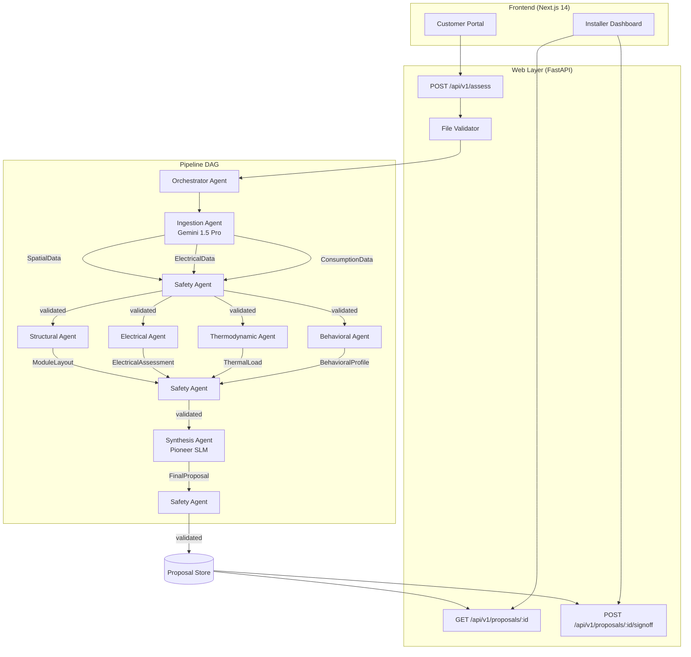

# Design Document: Zero-Touch Agent Pipeline

## Overview

This design covers the complete build-out of the Multimodal Zero-Touch Site Assessor pipeline — transforming homeowner-provided media (roofline video, electrical panel photo, utility bill PDF) into an engineering-grade solar + heat pump proposal without a physical site visit.

The system is composed of 8 independent sub-agents communicating exclusively via validated JSON (Pydantic v2 strict mode). A Safety Agent intercepts every inter-agent handoff. The pipeline DAG is:

```
Ingestion → [Structural ‖ Electrical ‖ Thermodynamic ‖ Behavioral] → Synthesis → Human Handoff
```

**What already exists:**
- All 9 Pydantic schemas (`src/common/schemas.py`)
- Safety Agent with validator + guardrails (36 tests passing)
- Structural Agent with layout engine (panel bin-packing, string sizing)
- Thermodynamic DIN EN 12831 calculation engine (no agent wrapper)
- Application config (`src/common/config.py`)

**What this design covers:**
- Thermodynamic Agent wrapper (`agent.py`)
- Electrical Agent (capacity analysis, upgrade logic, inverter recommendation)
- Behavioral Agent (occupancy detection, battery sizing, TOU arbitrage)
- Ingestion Agent (Gemini 1.5 Pro multimodal extraction)
- Synthesis Agent (Pioneer SLM integration, rule-based fallback)
- Orchestrator Agent (DAG execution, async parallel dispatch, safety gating)
- FastAPI web layer (file upload, proposal retrieval, installer sign-off)
- Installer Dashboard (Next.js 14 frontend)
- Comprehensive test suite for all agents

### Design Decisions

1. **Pure-function domain agents**: The Electrical, Behavioral, and Thermodynamic agents are deterministic — no LLM calls. This makes them fast, testable, and reproducible. Only the Ingestion Agent (Gemini) and Synthesis Agent (Pioneer SLM) use external AI APIs.

2. **Safety-first pipeline halting**: The Orchestrator never forwards a payload that the Safety Agent has rejected. A single validation failure halts the pipeline and returns structured errors. This is non-negotiable for residential energy systems.

3. **Async parallel execution**: The four domain agents (Structural, Electrical, Thermodynamic, Behavioral) run concurrently via `asyncio.gather`. The Orchestrator cancels remaining agents if any one fails.

4. **Rule-based fallback for Synthesis**: If the Pioneer SLM is unavailable, the Synthesis Agent falls back to deterministic component selection using the Reonic dataset pricing. This ensures the pipeline never blocks on a single external dependency.

5. **Human sign-off is immutable**: `human_signoff.required = True` is enforced at schema level (Pydantic `default=True`), guardrail level (Safety Agent rejects `False`), and API level (the sign-off endpoint only allows status transitions, never toggling `required`).

## Architecture



### Pipeline Execution Flow

1. **Upload**: Homeowner uploads video + photo + PDF via the Customer Portal or API
2. **Validation**: FastAPI validates file types and sizes (max 100 MB each)
3. **Ingestion**: Gemini 1.5 Pro extracts SpatialData, ElectricalData, ConsumptionData
4. **Safety Gate 1**: Safety Agent validates all three Ingestion outputs
5. **Parallel Domain**: Four domain agents run concurrently via `asyncio.gather`
6. **Safety Gate 2**: Safety Agent validates all four domain agent outputs
7. **Synthesis**: Pioneer SLM (or rule-based fallback) produces FinalProposal
8. **Safety Gate 3**: Safety Agent validates FinalProposal (including human_signoff.required = True)
9. **Storage**: Proposal persisted with `pipeline_run_id`
10. **Human Review**: Installer reviews and approves/rejects via Dashboard

## Components and Interfaces

### 1. Thermodynamic Agent (`src/agents/thermodynamic/agent.py`)

Wraps the existing `din_en_12831.py` calculation engine. No LLM dependency.

**Interface:**
```python
def run(spatial_data: SpatialData, consumption_data: ConsumptionData) -> ThermalLoad
```

**Logic:**
- Estimates `house_size_sqm` from `spatial_data.roof.total_usable_area_m2` (roof area ≈ floor area for typical residential)
- Calls `calculate_design_heat_load()` with design outdoor temp from config
- Calls `estimate_dhw_requirement()` for cylinder sizing
- Calls `recommend_heat_pump_capacity()` for heat pump selection
- Evaluates `fits_in_utility_room` by comparing cylinder physical volume against `utility_room.available_volume_m3`
- Sets `calculation_method = "DIN_EN_12831_simplified"` in metadata
- Uses default U-values when `building_year` is not available

### 2. Electrical Agent (`src/agents/electrical/agent.py`)

Deterministic assessment of the existing electrical installation.

**Interface:**
```python
def run(electrical_data: ElectricalData) -> ElectricalAssessment
```

**Logic:**
- Calculates `max_additional_load_A = main_supply.amperage_A - sum(breaker.rating_A for breaker in breakers)`
- Board upgrade required if: `amperage_A < 63` OR `board_condition in ("poor", "requires_replacement")`
- Three-phase conversion required if: `phases == 1` AND total planned load > 7.36 kW (32A × 230V)
- RCD addition required if: no breaker with `type in ("RCD", "RCBO")` exists
- Inverter recommendation: `hybrid` for single-phase, `three_phase` for three-phase
- EV charger compatible if: `has_ev == True` OR `spare_ways >= 2`
- `current_capacity_sufficient = (len(upgrades_required) == 0 and max_additional_load_A > 0)`

### 3. Behavioral Agent (`src/agents/behavioral/agent.py`)

Analyzes consumption patterns and optimizes battery sizing with TOU arbitrage.

**Interface:**
```python
def run(consumption_data: ConsumptionData) -> BehavioralProfile
```

**Logic:**
- **Occupancy detection**: Compare winter months (Nov–Feb) average to summer months (May–Aug) average. If winter/summer ratio > 1.5 → `home_all_day`; if ratio < 1.2 → `away_daytime`; else → `mixed`
- **Battery sizing**: `capacity_kwh = daily_avg_kwh × self_consumption_factor × occupancy_multiplier` where `daily_avg_kwh = annual_kwh / 365`, `self_consumption_factor` depends on occupancy pattern (0.3 for away_daytime, 0.5 for home_all_day), clamped to [0.5, 50] kWh range
- **TOU arbitrage**: When `tariff.time_of_use` is present, set charge window to off-peak hours, discharge window to peak hours, calculate `arbitrage_savings_eur_annual = shiftable_kwh × (peak_rate - off_peak_rate) × 365`
- **Charge/discharge non-overlap**: Validate that charge and discharge windows do not share any hours
- **Optimization schedule**: frequency = "quarterly", next_review = today + 90 days
- **Annual savings**: `self_consumption_savings + feed_in_revenue + arbitrage_savings`

### 4. Ingestion Agent (`src/agents/ingestion/agent.py`)

Multimodal extraction via Google Gemini 1.5 Pro.

**Interface:**
```python
async def process_video(file_path: Path) -> SpatialData
async def process_photo(file_path: Path) -> ElectricalData
async def process_pdf(file_path: Path) -> ConsumptionData
```

**Logic:**
- Validates file format before calling Gemini (MP4/MOV/WEBM for video, JPEG/PNG/HEIC for photo, PDF for bill)
- Sends structured prompts to Gemini requesting JSON output matching the target schema
- Parses Gemini response and constructs the Pydantic model
- Sets `confidence_score` from Gemini's extraction confidence
- Sets `gemini_model_version` from the API response metadata
- Extracts `bill_period_start` and `bill_period_end` from utility bill
- Retries up to 3 times with exponential backoff on API errors or timeouts
- Returns structured error with `source_type` on failure

**File format validation:**
```python
ALLOWED_VIDEO = {".mp4", ".mov", ".webm"}
ALLOWED_PHOTO = {".jpeg", ".jpg", ".png", ".heic"}
ALLOWED_PDF = {".pdf"}
```

### 5. Synthesis Agent (`src/agents/synthesis/agent.py`)

Combines all domain agent outputs into a FinalProposal.

**Interface:**
```python
async def run(
    module_layout: ModuleLayout,
    thermal_load: ThermalLoad,
    electrical_assessment: ElectricalAssessment,
    behavioral_profile: BehavioralProfile,
) -> FinalProposal
```

**Logic:**
- Populates `system_design.pv` from ModuleLayout (total_kwp, total_panels) + ElectricalAssessment (inverter_recommendation)
- Populates `system_design.heat_pump` from ThermalLoad (capacity_kw, type, cop_estimate)
- Populates `system_design.battery` from BehavioralProfile (capacity_kwh)
- Calls Pioneer SLM for component selection and pricing; falls back to rule-based Reonic dataset lookup on failure
- Calculates `total_cost_eur` = PV cost + battery cost + heat pump cost + electrical upgrade costs
- Calculates `annual_savings_eur` = BehavioralProfile.estimated_annual_savings_eur + heat pump operational savings
- Calculates `payback_years` = total_cost_eur / annual_savings_eur
- Always sets `human_signoff.required = True`, `human_signoff.status = "pending"`
- Includes all electrical upgrades in `compliance.electrical_upgrades`
- Generates unique `pipeline_run_id` in metadata

### 6. Orchestrator Agent (`src/agents/orchestrator/agent.py`)

Manages the pipeline DAG execution.

**Interface:**
```python
async def run_pipeline(
    video_path: Path,
    photo_path: Path,
    pdf_path: Path,
) -> FinalProposal | PipelineError
```

**Logic:**
- Generates unique `pipeline_run_id` at start (UUID4)
- Logs `pipeline_run_id` in all log messages
- **Stage 1**: Run Ingestion Agent → produces SpatialData, ElectricalData, ConsumptionData
- **Safety Gate 1**: Validate all three outputs via Safety Agent
- **Stage 2**: Run four domain agents concurrently via `asyncio.gather`:
  - Structural Agent(SpatialData) → ModuleLayout
  - Electrical Agent(ElectricalData) → ElectricalAssessment
  - Thermodynamic Agent(SpatialData, ConsumptionData) → ThermalLoad
  - Behavioral Agent(ConsumptionData) → BehavioralProfile
- **Safety Gate 2**: Validate all four outputs
- **Stage 3**: Run Synthesis Agent → FinalProposal
- **Safety Gate 3**: Validate FinalProposal
- On any Safety Agent rejection: halt pipeline, return ValidationResult errors
- On any unhandled exception: catch, log with pipeline_run_id, return structured error
- On any agent failure during parallel execution: cancel remaining agents
- Timeout: 120s per agent, 300s for full pipeline
- Logs start time, end time, and duration of each agent execution at INFO level

### 7. FastAPI Web Layer (`src/web/`)

**Endpoints:**

| Method | Path | Description |
|--------|------|-------------|
| POST | `/api/v1/assess` | Upload video + photo + PDF, trigger pipeline |
| GET | `/api/v1/proposals/{pipeline_run_id}` | Retrieve completed proposal |
| POST | `/api/v1/proposals/{pipeline_run_id}/signoff` | Installer approve/reject |

**POST /api/v1/assess:**
- Accepts `multipart/form-data` with fields: `video`, `photo`, `bill`
- Validates file types and sizes (max 100 MB each)
- Returns HTTP 413 if any file exceeds 100 MB
- Saves files to temp directory, triggers Orchestrator
- Returns `pipeline_run_id` and status

**GET /api/v1/proposals/{pipeline_run_id}:**
- Returns the FinalProposal JSON
- Returns HTTP 404 if not found

**POST /api/v1/proposals/{pipeline_run_id}/signoff:**
- Requires authentication (HTTP 401 if unauthenticated)
- Accepts `{"action": "approve" | "reject", "notes": "..."}`
- Updates `human_signoff.status`, `installer_id`, `signed_at`
- Rejection requires `notes` field
- Returns HTTP 422 if pipeline failed (with Safety Agent errors)

### 8. Installer Dashboard (Next.js 14)

- Lists pending proposals for the authenticated installer
- Displays full FinalProposal details (system_design, financial_summary, compliance)
- Provides Approve/Reject actions calling the signoff API
- Prevents proposal delivery to customer while status is "pending"
- Rejection requires a notes field explaining the reason

## Data Models

All data models are already defined in `src/common/schemas.py` as Pydantic v2 models with `extra = "forbid"` (strict mode). The 9 inter-agent schemas are:

```mermaid
erDiagram
    SpatialData ||--|| RoofData : contains
    SpatialData ||--|| UtilityRoom : contains
    SpatialData ||--|| IngestionMetadata : has
    RoofData ||--|{ RoofFace : has
    RoofData ||--|{ Obstacle : has

    ElectricalData ||--|| MainSupply : contains
    ElectricalData ||--|{ Breaker : has
    ElectricalData ||--|| IngestionMetadata : has

    ConsumptionData ||--|{ MonthlyConsumption : has
    ConsumptionData ||--|| Tariff : has
    ConsumptionData ||--|| IngestionMetadata : has
    Tariff ||--o| TimeOfUse : may_have

    ModuleLayout ||--|{ FaceLayout : has
    ModuleLayout ||--|| StringLayout : has
    ModuleLayout ||--|| CalculationMetadata : has
    StringLayout ||--|{ StringConfig : has

    ThermalLoad ||--|| HeatPumpRecommendation : has
    ThermalLoad ||--|| DHWRequirement : has
    ThermalLoad ||--o| UValues : may_have
    ThermalLoad ||--|| CalculationMetadata : has

    ElectricalAssessment ||--|{ UpgradeRequired : has
    ElectricalAssessment ||--|| InverterRecommendation : has
    ElectricalAssessment ||--|| SimpleMetadata : has

    BehavioralProfile ||--|| BatteryRecommendation : has
    BehavioralProfile ||--|| OptimizationSchedule : has
    BehavioralProfile ||--|| SimpleMetadata : has

    FinalProposal ||--|| SystemDesign : has
    FinalProposal ||--|| FinancialSummary : has
    FinalProposal ||--|| Compliance : has
    FinalProposal ||--|| HumanSignoff : has
    FinalProposal ||--|| ProposalMetadata : has
    SystemDesign ||--|| PVDesign : has
    SystemDesign ||--|| BatteryDesign : has
    SystemDesign ||--|| HeatPumpDesign : has
```



### Key Schema Constraints (enforced by Pydantic + Safety Agent)

| Schema | Constraint | Enforcement |
|--------|-----------|-------------|
| StringConfig | `voc_string_V ≤ 1000` | Pydantic `Field(le=1000)` + guardrail |
| HeatPumpRecommendation | `2 ≤ capacity_kw ≤ 50` | Pydantic `Field(ge=2, le=50)` |
| BatteryRecommendation | `0.5 ≤ capacity_kwh ≤ 50` | Pydantic `Field(ge=0.5, le=50)` |
| HumanSignoff | `required = True` always | Pydantic default + guardrail CRITICAL |
| DHWRequirement | `cylinder_volume_litres ∈ {150,170,200,210,250,300}` | Guardrail check |
| Breaker | `rating_A ∈ {6,10,13,16,20,25,32,40,50,63,80,100,125}` | Guardrail check |
| ConsumptionData | `|Σ monthly - annual| ≤ 10%` | Guardrail check |
| IngestionMetadata | `confidence_score ≥ 0.6` | Guardrail warning |

### Proposal Storage

For the initial implementation, proposals are stored in-memory using a `dict[str, FinalProposal]` keyed by `pipeline_run_id`. This is sufficient for development and testing. A persistent store (PostgreSQL or DynamoDB) is a future enhancement.

